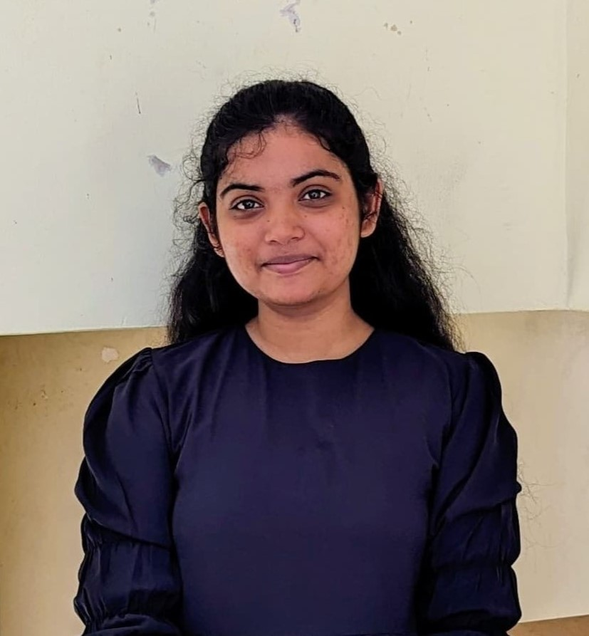

# Keran Shama Sudharshan — Portfolio Website

## 📁 Folder Structure
```
portfolio/
├── index.html          ← Main portfolio page
├── style.css           ← All styles
├── script.js           ← Interactivity (tabs, modal, scroll effects)
├── assets/
│   ├── Keran_CV.pdf    ← ⚠️ ADD YOUR CV HERE (rename to Keran_CV.pdf)
│   ├── images/         ← ⚠️ ADD YOUR PROFILE PHOTO HERE
│   └── certs/          ← All certificate evidence images (already included)
```

## 📸 Where to Add Your Images

### 1. Profile Photo (REQUIRED — Hero Section)
- Place your photo file in: `assets/images/profile.jpg`
- Then in `index.html`, find the `<div class="photo-frame" id="profilePhotoFrame">` section
- Replace the entire placeholder div with:
  ```html
  
  ```
- OR: simply click "Upload Photo" button when viewing the site in a browser

### 2. CV Download (REQUIRED)
- Place your CV PDF at: `assets/Keran_CV.pdf`

### 3. Postman Certificate (Certifications Section)
- Add your Postman Student Expert certificate image to: `assets/certs/postman-cert.png`
- The card is already set up to display it — just add the file

### 4. Selenium Certificate (when complete)
- When you finish your Selenium certification, add the image to: `assets/certs/selenium-cert.png`
- Then replace the placeholder card in `index.html` to show the image

## 🌐 How to Host (Free Options)

### Option A: GitHub Pages (Recommended)
1. Create a GitHub repository named `portfolio` (or `your-username.github.io`)
2. Upload all files maintaining the folder structure
3. Go to Settings → Pages → select `main` branch → Save
4. Your site will be live at: `https://KeranShama.github.io/portfolio`

### Option B: Netlify
1. Go to https://netlify.com
2. Drag and drop the entire `portfolio/` folder
3. Get instant live URL

### Option C: Vercel
1. Go to https://vercel.com
2. Connect GitHub repo or upload folder
3. Deploy instantly

## ✅ All Evidence Already Included
- IEEE WIE Service Letter ✓
- RUSL InnOrbit 2nd Place ✓
- ZeroPlastic Certificate ✓
- IEEEXtreme Certificate ✓
- BITCODE V5.0 Certificate ✓
- IEEE YP Summit 2024 ✓
- ChefBuddy Project ✓
- NeuroGen AI Session ✓
